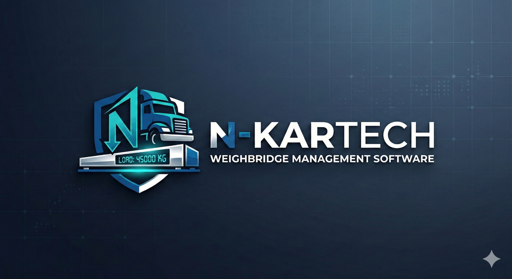
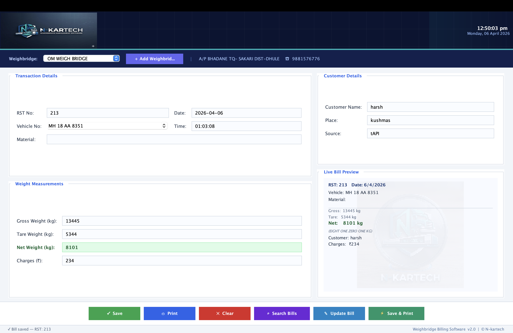
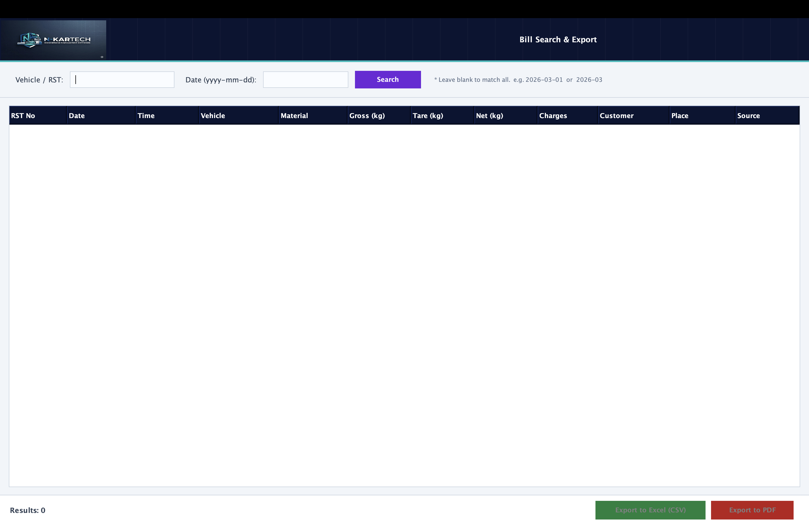
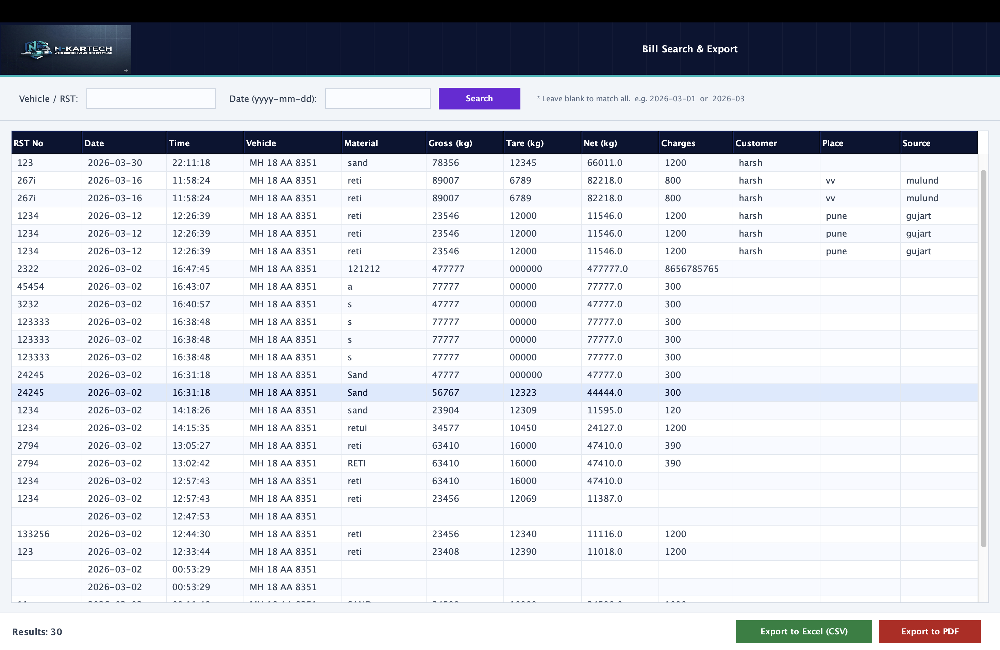

# 🚛 N-KARTECH Weighbridge Management Software



> A **production-ready weighbridge billing system** built using **Java Swing + SQLite**, designed for real-world industrial use.

---

##  Overview

**N-KARTECH** is a desktop-based application developed to manage weighbridge operations efficiently.

This software was **built for a real client requirement** and successfully delivered as a **paid solution (₹10000)** 💼 — making it not just a project, but a **practical business product**.

---

## ✨ Features

### 🧾 Billing System

* Create and manage weighbridge bills
* Auto-calculation of **Net Weight (Gross - Tare)**
* Save, update, and print bills

### 🔍 Search & Export

* Search by:

  * Vehicle Number
  * RST Number
  * Date
* Export data to:

  * 📊 CSV (Excel)
  * 📄 PDF

### ⚡ Smart Functionalities

* Live bill preview
* Vehicle auto-save system
* Multi-weighbridge support
* Clean and modern UI

### 🖥️ UI Highlights

* Dashboard-based layout
* Real-time clock
* Splash screen animation
* Professional print format

---

## 📸 Screenshots

### 🔹 Main Dashboard



### 🔹 Search & Export Interface



### 🔹 Data Results & Export



---
## 📄 Sample Outputs

- [Sample Bill PDF](samples/sample_bill.pdf)
- [Sample Excel Export](samples/sample_data.csv)
- [Sample Export PDF](samples/sample_data.pdf)

“All sample data used in this repository is dummy data for demonstration purposes.”

## 🛠️ Tech Stack

| Technology | Usage                 |
| ---------- | --------------------- |
| Java Swing | GUI Development       |
| SQLite     | Database              |
| JDBC       | Database Connectivity |
| AWT        | Graphics & Printing   |

---

## 📂 Project Structure

```bash
YourProject/
├── Main.java
├── images/
│   ├── logo_banner.png
│   ├── logo_icon.png
│   ├── screenshot_main.png
│   ├── screenshot_search_empty.png
│   └── screenshot_search_data.png
└── weighbridge.db   (auto-created)
```

---

## ⚙️ Installation & Setup

### 1️⃣ Clone Repository

```bash
git clone https://github.com/your-username/n-kartech-weighbridge.git
cd n-kartech-weighbridge
```

### 2️⃣ Add Required Images

Create `images/` folder and add:

* `logo_banner.png`
* `logo_icon.png`
* Screenshots (optional but recommended)

### 3️⃣ Compile

```bash
javac Main.java
```

### 4️⃣ Run

```bash
java Main
```

---

## 🧠 How It Works

* User enters vehicle + weight details
* System calculates:

```
Net Weight = Gross Weight - Tare Weight
```

* Data is stored in SQLite database
* Bills can be printed or exported

---

## 🗄️ Database Schema

### 📌 Tables

**1. bills**

* rst, date, time
* vehicle, material
* gross, tare, net
* charges
* customer_name, place, source

**2. weighbridges**

* name, address, phone

**3. vehicles**

* vehicle_no

---

## 💼 Real-World Usage

✔ Developed for an actual client
✔ Solved real operational problem
✔ Delivered as a paid software (₹7000)

This demonstrates:

* Practical development skills
* UI/UX understanding
* Database design
* End-to-end product delivery

---

##  Future Improvements

* Cloud sync & backup
* Multi-user login system
* Web version (React + Spring Boot)
* Analytics dashboard
* Mobile integration

---

## 👨‍💻 Author

**Harsh Nerkar**
Computer Engineering Student 

---

## 📜 License

This project can be used for learning and commercial purposes.

---

## ⭐ Support

If you like this project:

* ⭐ Star this repo
* 🍴 Fork it
* 🛠️ Contribute

---

> “Built for real-world problems, not just assignments.” 🚀
